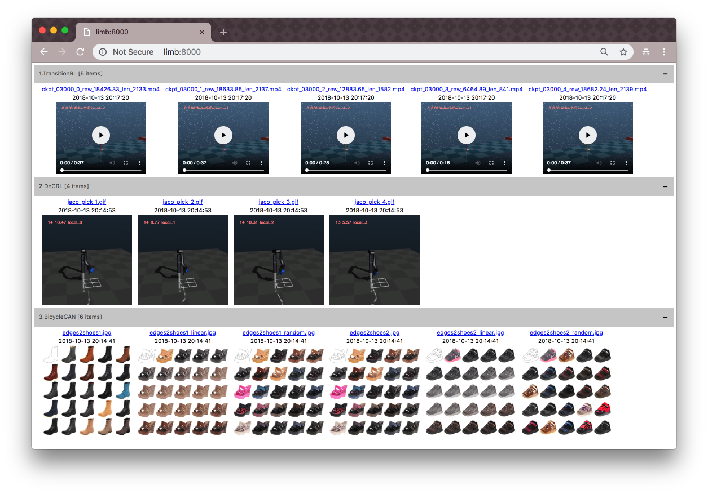

# videoboard

Simple http server for visualizing videos and images.

Videoboard launches a simple http server which recursively searches directories and shows all videos and images grouped by directory.<br>
It supports videos and images with extensions `mp4`, `png`, `jpg`, `jpeg`, and `gif`.



> This repo is initiated to check training and testing results for Reinforcement Learning research. <br>
> Using Python's SimpleHTTPServer requires me to navigate forward and backward. <br>
> It is especially annoying when multiple experiments are running. <br>
> Videoboard makes visualizing videos from multiple directories much easier.


## Usage

1. Run videoboard:
```
$ videoboard
```

Options:

* `--logdir`           : Directory where videoboard will look for videos and images recursively
* `--port`             : Port number
* `--height`           : Maximum height of image/video
* `--width`            : Maximum width of image/video
* `--file_name_length` : Maximum length of file name shown in videoboard
* `--recursive`        : Search files recursively
* `--display`          : Display videos and images

2. Check the website at `http://127.0.0.1:8000` or `http://[server]:[port]`.

Whenever click a directory, videos and images inside will be reloaded.


## Installation

Install from pip:
```
pip install videoboard
```

Install from the latest version:
```
git clone https://github.com/youngwoon/videoboard.git
cd videoboard
pip install -e .
```


## License

[MIT License](LICENSE)

